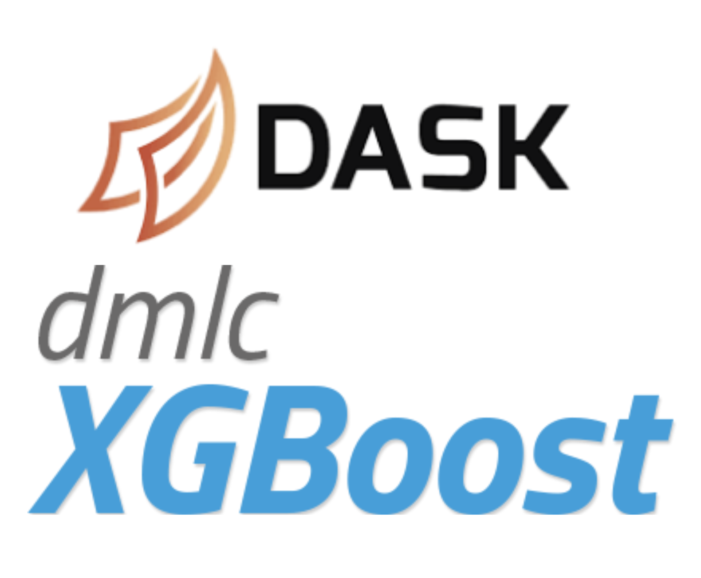

# Distributed XGBoost with Dask on CML

In this Applied ML Prototype, we go beyond what we can achieve with a single laptop, and use the Cloudera Machine Learning Workers API to spin up an on-demand Dask cluster to distribute training an XGBoost model for a credit card fraud detection use case. This sets us up for machine learning at scale!




### Distributed computing
It's important to understand what we mean here, since there are several paradigms for scaling machine learning workflows.

**Compute-constrained.** In this scenario, the model size or training complexity is such that execution would simply take too long to complete in a reasonable time. This can happen, for example, when tuning a large model's hyperparameters or when performing cross validation. One way to handle this is to parallelize the computation, e.g., use each node in the cluster to train a separate set of hyperparameters for a given model. 

**Memory-constrained.** In this scenario, the data is larger than can comfortably fit into memory and must instead be distributed across the nodes of your cluster. This necessitates distributing your ML model across those same nodes, a feature of ensemble models like XGBoost. This is the type of distributed computing we demonstrate in this notebook. 


### Data
This AMP makes use of a sample of the [credit card fraud dataset](https://www.kaggle.com/mlg-ulb/creditcardfraud) curated by the machine learning group at Université Libre de Bruxelles. You can obtain the full dataset by creating a Kaggle account and downloading from the link above. Note that this data sample actually fits comfortably in memory; instead, the notebook is intended to demonstrate the necessary steps should you come across a memory-constrained use case. 


## Project Structure
```
.
├── LICENSE
├── README.md
├── .project-metadata.yaml              # declarative specification for AMP logic
├── cdsw-build.sh                       # build script for model endpoint
├── requirements.txt
├── data                                # directory to hold sample data
├── model                               # directory to store trained XGBoost models
├── notebooks                           # Jupyter notebooks that are the focus of this AMP
│   ├── dask-intro.ipynb                    
│   └── distributed-xgboost-with-dask.ipynb 
├── scripts
│   ├── install_dependencies.py         
│   └── predict_fraud.py                # inference script for a model endpoint
└── utils
    ├── __init__.py
    └── dask_utils.py                   # functionality to simplify Dask cluster creation
```

## Deploying on Cloudera Machine Learning (CML)

There are three ways to launch this project on CML:

1. **From AMP Catalog** - Navigate to the AMP Catalog in a CML workspace, select the "Distributed XGBoost with Dask on CML" tile, click "Launch as Project", click "Configure Project".
2. **As an Applied ML Prototype** - In a CML workspace, click "New Project", add a Project Name, select "AMP" as the Initial Setup option, copy in the repo URL, click "Create Project", click "Configure Project"
3. **Manual Setup** - In a CML workspace, click "New Project", add a Project Name, select "Git" as the Initial Setup option, copy in the repo URL, click "Create Project". In this case, manual installation of the notebook dependencies is required by adding and running `!pip install -r requirements.txt` in the JupyterLab Notebook.

Once the project has been initialized in a CML workspace, run either the `notebooks/dask-intro.ipynb` or `notebooks/distributed-xgboost-with-dask.ipynb` notebooks by starting a Python 3.9+ JupyterLab Session with 1 vCPU / 2 GiB for resourcing.